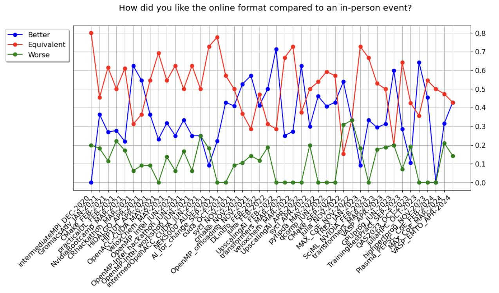
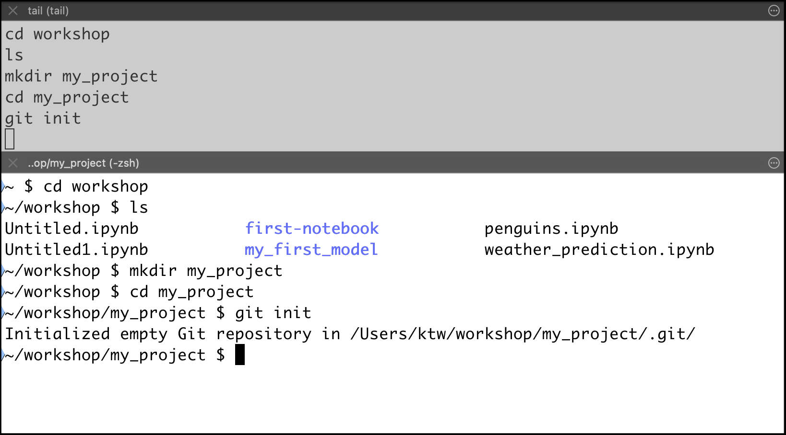

# Teaching Mechanics

```{objectives}
- Discuss practical aspects of teaching
- Understand the benefits and disadvantage of online teaching compared to in-person
```

## Online vs in-person workshops

Challenges:
- More difficult for learners to stay focused during for a full day - "Zoom fatigue"
- More confusion and cognitive overload from watching and listening to instructor while typing 
  along or solving exercises 
- Networking and socialisation is much more difficult
- Group work takes more effort to prepare to encourage interaction between learners
- Learners more often stay quiet
- Signaling problems or asking questions is more difficult
- Awkwardness during silences or when multiple people start talking at the same time
- Lack of non-verbal cues

Benefits:
- More geographically inclusive
- No travel costs
- Possible for learners and teachers to participate in larger number of events
- More natural format for collaborative teaching 
- Easier to scale up

Solutions to some of the challenges:
- Only teach half days
- Avoid cognitive overload by slowing down and including more "meta talk"
- Use icebreaker questions for general introductions and to encourage active participation
- Learners introduce themselves in groups using breakout rooms
- Use shared workshop document for questions and answers and to signal problems
- Strongly recommend screen sharing and colloboration in breakout room exercises


But **what do learners actually think of online workshops compared to in-person workshops**?
Here's how learners in ENCCS workshops replied to a post-workshop survey question about the 
online format:



However, the survey question is simple and the answers do not reveal any details about the 
pros and cons of online workshops perceived by the workshop participants.

---

## Tooling 

The mechanics of online (or in-person) teaching is all about the tools and visual 
aspects of teaching. It is important to plan and prepare these technical 
aspects before a workshop.

- The learner has a *lot* more to think about than the instructor, so you need
  to minimize the possible distractions and unnecessary weirdness.
- A learner will often use only one small screen, limiting the number of
  things that they can focus on.
- You are much faster than learners. You have to do things to slow yourself down.

### Shell sharing

When doing any demonstration, there are difficulties:

- If one misses something, you can't rewind to see it - is there any
  way to catch up?
- The learner must get oriented with the whole picture, while
  instructor knows precisely where to focus.

A good **shell share** has some of the following properties:

- Large font
- Shell history, available separately from the main shell window
- Closely matches the type-along instructions

A collection of good practices for screen sharing your shell environment can be found  
[here](https://coderefinery.github.io/manuals/instructor-tech-setup).

Simple examples:

`````{tabs}
````{tab} Bash

Set up simple prompt:
```console
$ export PS1='\n\w\$ '
```

Define a command to be executed before new prompt:
```console
$ PROMPT_COMMAND="history -a"
```

In new terminal, print updates to history file:
```console
$ tail -f -n0 ~/.bash_history
```

````
````{tab} Zsh

Set up simple prompt:
```console
$ export PROMPT='%~ $ '
```

Define command to be executed just after a command has been read and is about to be executed:
```console
$ preexec() { echo $1 >> ~/demos.out }
```

In new terminal, print updates to demos.out file:
```console
$ tail -f ~/demos.out
```

````
`````


> *One way to set up your shell with light background, large font, simple prompt and shell history.*

### Screen sharing


- Many learners will have a smaller screen than you.
- You should plan for learners with only one small screen.
- A learner will **need to focus on both your screen share and their
  work**.
- Sharing your a whole screen is probably a bad idea if you want
  the learners to do anything at the same time.
- If you constrict yourself, then your experience is more similar to
  that of a learner.

Vertical sharing:
- CodeRefinery and ENCCS have recently started trialing a **vertical share**
  system, where you share a vertical half of your screen.
- This allows learners with one screen to display your screen
  side-by-side with their own applications.
- Zoom provides a "Share a part of screen" that is good for this.


> *Example of vertical screen share with lesson material above and terminal below.*


> *Example of how a learner can arrange their screens. Instructor screenshare on the left, own*
> *windows on the right.*


> *Example of how the instructor can arrange windows. Zoom is sharing a portion on the left, the* 
> *right side is free for collaborative document, teaching notes, chat with other instructors etc.*

---

## Shared workshop document

Questions and frequent feedback is very important for interactive workshops,
but questions in the main room doesn't scale to large rooms. Also, it's likely 
that only a few (extrovert) participants will do most of the talking while others 
will not feel as comfortable speaking up.

A strategy shared by the Carpentries, CodeRefinery and ENCCS is to use a shared workshop 
document where learners can ask questions on the fly. The document can also be used to 
collect all relevant information for a workshop, including links to material and technical 
instructions, as well as for formative assessment questions and to take notes from group work.
Out of many possible platforms, ENCCS uses [HackMD](https://hackmd.io/).

Some features of HackMD and how it compares to other modes of communication:
- Chat is not good enough, you can't easily reply to old things and finding earlier information is difficult.
- HackMD allows threaded replies and follow up later.
- You need some other instructors/helpers to watch HackMD and provide answers, bring
  relevant questions to your attention, and let you know how things are going.
- Learners can ask anonymously.
- Learners don't have to worry about interrupting the flow.
- The document stays online and can be revisited by learners to remind themselves of valuable Q&A
  and discussions.
- Disadvantage: can produce cognitive overload, warn people to not follow too closely.
- With too few people, it can turn out to be very quiet.
- Example: [https://hackmd.io/@enccs/dl-intro-feb2022](https://hackmd.io/@enccs/dl-intro-feb2022)

---

## Team teaching

Demonstration-based teaching require two different types of focus:

- Doing the mechanical steps as a demonstration
- Explaining why you are doing it

This is a lot for one person to keep in mind, so can multiple people
work together for this? Team teaching idea:
- One person is doing the demonstrations
- One person is giving the commentary about what they are doing
- The lecture becomes a discussion between two people instead.

```{callout} Co-teaching

   Wikipedia: Co-teaching or team teaching is the division of labor
   between educators to plan, organize, instruct and make assessments
   on the same group of students, generally in the a common
   classroom,[1] and often with a strong focus on those teaching as a
   team complementing one another's particular skills or other
   strengths.
```

Advantages:
- The course seems very interactive, much more so than expecting
  students to speak up.  The co-teacher can take on the "voice of the
  audience".
- Quicker preparation time since co-teachers can rely on each other in
  unexpected situations.
- One co-teacher can be effectively learning at the same time and thus
  acting as the "voice of the audience" in another way.
- Great way to onboard new instructors - extensive training and
  preparation no longer needed.
- More active minds means better able to watch and react to other
  feedback, such as HackMD or chat.
- Less workload - one person does not have to prepare perfectly, any
  uncertainty can usually be quickly answered by the other.

Disadvantage:
- Requires two people's time
- Requires coordination when preparing (slows you down in preparation)
- Unfamiliar concept to most people

### Strategies

In reality, these strategies are mixed and matched even within a
lesson, and there are many things between these:

- One person gives lectures, one does the typing during demos.
- "Interview": One primarily doing the "teaching", one guiding by
  asking questions - either as an interviewer or as a virtual learner.

Things that don't work (are not team teaching):

- Dividing up a lesson into parts, each person gives different parts
  independently.

---


## See also

- [Instructor introduction](https://coderefinery.github.io/manuals/instructor-intro/) -
  has a lot of tips for new instructors, but also more things about the workshop.
- [Instructor tech setup](https://coderefinery.github.io/manuals/instructor-tech-setup/)
- [Lesson preparation hints](https://coderefinery.github.io/manuals/presenting/) (more focused on in-person)
- [HackMD mechanics](https://coderefinery.github.io/manuals/hackmd-mechanics/) and [HackMD helpers](https://coderefinery.github.io/manuals/hackmd-helper/).  
- [Team teaching](https://coderefinery.github.io/manuals/team-teaching/)


